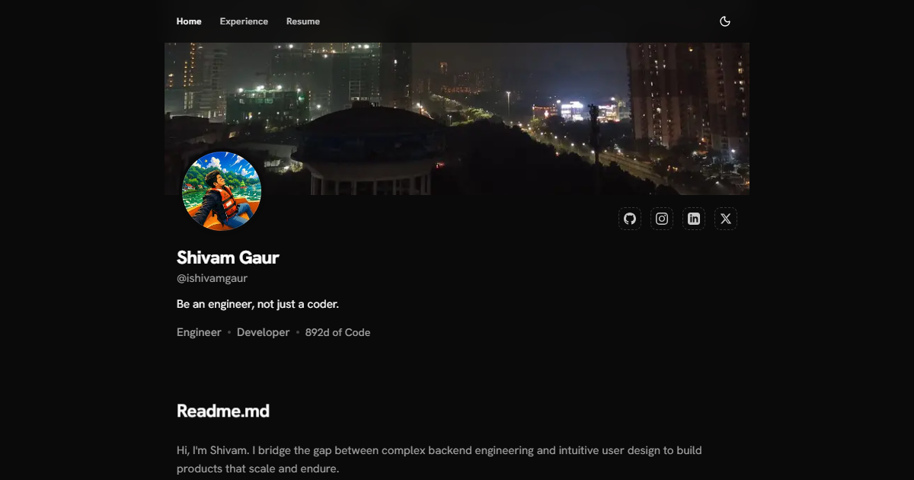

<p align="center">
  
</p>

<h1 align="center">Shivam Gaur — Portfolio</h1>

<p align="center">
  <strong>A sleek, modern developer portfolio built with Next.js 16, Tailwind CSS, and Framer Motion.</strong>
</p>

<p align="center">
  <a href="https://shivamgaur.space">🌐 Live Site</a> •
  <a href="https://github.com/ishivamgaur">GitHub</a> •
  <a href="https://linkedin.com/in/ishivamgaur">LinkedIn</a> •
  <a href="https://instagram.com/ishivamgaur">Instagram</a> •
  <a href="https://twitter.com/ishivamgaur">Twitter/X</a>
</p>

<p align="center">
  
  
  
  
  
  
</p>

---

## ✨ Overview

A modern, high-performance developer portfolio designed to showcase projects, experience, and personal brand. Built with the **Next.js App Router** and server-side rendering.

**Key highlights:**

- ⚡ **Next.js 16** App Router with Turbopack for instant dev feedback
- 🎨 **Dark/Light mode** with animated icon transitions (spring physics)
- 🌀 **Page transitions** with Framer Motion fade + slide animations
- 📱 **Fully responsive** — optimized for mobile, tablet, and desktop
- 🤖 **AEO & GEO optimized** — structured data, llms.txt, ai.txt, RSS feed
- 🔐 **Admin dashboard** for managing stories, resume, and site settings
- 🎵 **Spotify Now Playing** widget with real-time polling
- 📸 **Instagram-style Stories** viewer with auto-advance and swipe navigation
- 💬 **Random quote** system with non-repeating rotation

---

## 📸 Pages

| Page | Description |
|---|---|
| **Home** | Hero section with profile avatar, banner, about, experience preview, projects grid, personal section, and random quotes |
| **Experience** | Detailed work history with tech stack icons and key contributions per role |
| **Projects** | Grid of project cards with thumbnails, tech tags, and individual detail pages |
| **Resume** | Embedded PDF viewer with text selection and download support |
| **100 List** | Personal bucket list with completion tracking |
| **Favorite Movies** | Curated movie list with directors and years |
| **Admin** | Auth-protected dashboard for stories, resume, and settings management |

<p align="center">
  
  
</p>
<p align="center">
  
  
</p>

---

## 🛠 Tech Stack

### Frontend

| Technology | Version | Purpose |
|---|---|---|
| [Next.js](https://nextjs.org) | 16.2.4 | React framework — App Router, SSR/SSG, API routes |
| [React](https://react.dev) | 19.2.4 | UI library |
| [TypeScript](https://typescriptlang.org) | 5.x | Type safety |
| [Tailwind CSS](https://tailwindcss.com) | 4.x | Utility-first styling with OKLCH color system |
| [Framer Motion](https://motion.dev) | 12.38 | Page transitions, scroll animations, AnimatePresence |
| [Shadcn UI](https://ui.shadcn.com) | 4.5 | Accessible UI components (Button, Tooltip, Avatar, Skeleton) |
| [Redux Toolkit](https://redux-toolkit.js.org) | 2.11 | Global state management |
| [next-themes](https://github.com/pacocoursey/next-themes) | 0.4.6 | Dark/Light mode |
| [Lucide React](https://lucide.dev) | 1.11 | Icon library |
| [react-pdf](https://github.com/wojtekmaj/react-pdf) | 10.4 | PDF resume viewer with text selection |
| [react-easy-crop](https://github.com/ValentinH/react-easy-crop) | 5.5 | Image cropping in admin panel |

### Backend

| Technology | Version | Purpose |
|---|---|---|
| Next.js API Routes | — | Serverless backend endpoints |
| [MongoDB](https://mongodb.com) + [Mongoose](https://mongoosejs.com) | 9.5 | Database & ODM |
| [jose](https://github.com/panva/jose) | 6.2 | JWT authentication (edge-compatible) |
| [bcryptjs](https://github.com/dcodeIO/bcrypt.js) | 3.0 | Password hashing |
| [nodemailer](https://nodemailer.com) | 8.0 | Email sending |
| [rate-limiter-flexible](https://github.com/animir/node-rate-limiter-flexible) | 11.0 | API rate limiting |

### DevOps & Tooling

| Tool | Purpose |
|---|---|
| [Vercel](https://vercel.com) | Deployment & hosting |
| [Umami](https://umami.is) | Privacy-focused analytics |
| [Turbopack](https://turbo.build/pack) | Bundler (dev mode — ~720ms cold start) |
| [ESLint](https://eslint.org) | Linting |
| [Prettier](https://prettier.io) | Code formatting |

---

## 📁 Project Structure

```
client/
├── public/                     # Static assets (OG images, profile pic, banner, favicon)
│   ├── og-home.png             # Open Graph image — homepage
│   ├── og-experience.png       # Open Graph image — experience
│   ├── og-projects.png         # Open Graph image — projects
│   ├── og-resume.png           # Open Graph image — resume
│   ├── og-100-list.png         # Open Graph image — bucket list
│   ├── og-movies.png           # Open Graph image — movies
│   ├── profile-pic.jpg         # Profile avatar
│   ├── banner.jpg              # Hero banner image
│   ├── favicon.ico             # Favicon
│   └── manifest.json           # Web App Manifest
├── src/
│   ├── app/
│   │   ├── (pages)/            # Route group — public pages
│   │   │   ├── 100-list/       #   Bucket list with ItemList schema
│   │   │   ├── experience/     #   Work history with ProfilePage schema
│   │   │   ├── movies/         #   Favorite movies with Movie schema
│   │   │   ├── projects/       #   Project grid + [id] detail pages
│   │   │   └── resume/         #   PDF viewer with revalidation
│   │   ├── (seo)/              # Route group — SEO/AEO/GEO endpoints
│   │   │   ├── .well-known/    #   security.txt (RFC 9116)
│   │   │   ├── ai.txt/         #   AI training permissions (IETF AIPREF)
│   │   │   ├── feed.xml/       #   RSS 2.0 feed
│   │   │   ├── humans.txt/     #   Creator credits (humanstxt.org)
│   │   │   ├── llms-full.txt/  #   Complete portfolio for LLMs
│   │   │   └── llms.txt/       #   Concise LLM summary (llmstxt.org)
│   │   ├── admin/              # Auth-protected admin dashboard
│   │   ├── api/                # Serverless API routes
│   │   │   ├── analytics/      #   Page visit tracking
│   │   │   ├── auth/           #   login, logout, check, change-password
│   │   │   ├── github/         #   GitHub stats proxy
│   │   │   ├── health/         #   Health check endpoint
│   │   │   ├── settings/       #   Site settings CRUD
│   │   │   ├── spotify/        #   Spotify Now Playing proxy
│   │   │   ├── stories/        #   Stories CRUD + [id] routes
│   │   │   └── upload/         #   File upload handler
│   │   ├── globals.css         # Tailwind config, OKLCH theme, scrollbar, shimmer
│   │   ├── layout.tsx          # Root layout — fonts, providers, JSON-LD schemas
│   │   ├── page.tsx            # Homepage (Hero → About → Experience → Projects → Personal)
│   │   ├── providers.tsx       # ThemeProvider + Redux Provider + TooltipProvider
│   │   ├── robots.ts           # robots.txt with 18 bot rules (incl. AI crawlers)
│   │   └── sitemap.ts          # Dynamic XML sitemap (static + project routes)
│   ├── components/
│   │   ├── animations/
│   │   │   ├── FadeIn.tsx      # Scroll-triggered fade with directional slide
│   │   │   └── PageTransition.tsx  # Route change fade + slide animation
│   │   ├── layout/
│   │   │   ├── Navbar.tsx      # Fixed navbar with frosted glass backdrop-blur
│   │   │   └── Footer.tsx      # Navigation links, social icons, copyright
│   │   ├── portfolio/
│   │   │   ├── ExperienceItem.tsx  # Work experience card with tech icons
│   │   │   ├── ProjectCard.tsx     # Project card with thumbnail and tags
│   │   │   ├── ResumeHeader.tsx    # Resume page header
│   │   │   └── ResumeViewer.tsx    # PDF viewer with react-pdf
│   │   ├── sections/
│   │   │   ├── Hero.tsx        # Profile, banner, stories, GitHub stats, Spotify
│   │   │   ├── About.tsx       # Professional bio with skill cards
│   │   │   ├── Experience.tsx  # Work history preview section
│   │   │   ├── Projects.tsx    # Projects grid section
│   │   │   ├── Personal.tsx    # 100-list + movies links
│   │   │   └── Quotes.tsx      # Random non-repeating quote display
│   │   ├── ui/                 # Shadcn UI components
│   │   └── widgets/
│   │       ├── ThemeToggle.tsx      # Dark/light switch with spring animation
│   │       ├── SpotifyNowPlaying.tsx # Live Spotify "Recently listened" widget
│   │       ├── Stories.tsx          # Story thumbnail ring display
│   │       ├── StoryViewer.tsx      # Full-screen story viewer with auto-advance
│   │       ├── FileUpload.tsx       # Admin file upload with image cropping
│   │       └── AnalyticsTracker.tsx # Page visit reporter
│   ├── config/
│   │   └── site.ts             # Centralized SEO config (URLs, keywords, OG images)
│   ├── data/
│   │   └── portfolio.ts        # Static data (projects, experiences, quotes, movies, bucket list)
│   ├── lib/                    # Database connection + utility functions
│   ├── models/                 # Mongoose schemas (6 models)
│   ├── services/               # API service layer (fetch functions + Redux actions)
│   └── store/                  # Redux store + portfolio slice
```

---

## 🤖 SEO / AEO / GEO

This portfolio implements cutting-edge search optimization for both traditional search engines and AI-powered platforms.

### Traditional SEO
- ✅ Dynamic `<title>`, `<meta description>`, `<meta keywords>` per page
- ✅ Open Graph & Twitter Card meta tags with custom OG images per page
- ✅ Canonical URLs and alternate links
- ✅ XML Sitemap with all static + dynamic project routes
- ✅ Google, Bing, and Yandex webmaster verification support
- ✅ Semantic HTML with proper heading hierarchy

### Structured Data (Schema.org JSON-LD)
| Schema | Page | What it provides |
|---|---|---|
| `Person` | Root Layout | Identity, skills, potentialAction (hire/contact), worksFor, alumniOf |
| `WebSite` | Root Layout | Site identity with publisher reference |
| `FAQPage` | Root Layout | 6 Q&As for AI answer engines |
| `SpeakableSpecification` | Root Layout | Voice assistant compatibility |
| `SiteNavigationElement` | Root Layout | Navigation structure |
| `ProfilePage` | Experience | Work history with credentials |
| `EducationalOccupationalCredential` | Experience | 3 roles with dates and descriptions |
| `CollectionPage` + `SoftwareApplication` | Projects | Each project as a software entity |
| `ItemList` + `Movie` | Movies | 21 movies with director and year |
| `ItemList` | 100 List | 25 bucket list items with completion status |
| `BreadcrumbList` | All subpages | Navigation breadcrumbs |

### AEO (Answer Engine Optimization)
- ✅ **FAQPage schema** — AI assistants pull answers directly for queries like "Who is Shivam Gaur?"
- ✅ **Speakable schema** — Google Assistant, Alexa, Siri can read the bio aloud
- ✅ **potentialAction** — "View Resume", "View Projects", "Contact via Email" actions
- ✅ **Answer-ready content** — concise, factual professional summaries

### GEO (Generative Engine Optimization)
- ✅ **robots.txt** — 18 bot rules covering GPTBot, ChatGPT-User, ClaudeBot, PerplexityBot, Google-Extended, Applebot, CopilotBot, FacebookBot, meta-externalagent, cohere-ai, and more
- ✅ **llms.txt** — structured site summary for LLMs ([llmstxt.org](https://llmstxt.org))
- ✅ **llms-full.txt** — complete portfolio content with full work history, project details, movies, and bucket list
- ✅ **ai.txt** — AI training/citation permissions (IETF AIPREF Working Group)
- ✅ **feed.xml** — RSS 2.0 feed with all projects and experiences
- ✅ **security.txt** — RFC 9116 at `/.well-known/security.txt`
- ✅ **humans.txt** — creator credits ([humanstxt.org](https://humanstxt.org))

### Machine-Readable Endpoints

| Endpoint | Standard | Purpose |
|---|---|---|
| `/robots.txt` | Robots Exclusion | Crawler permissions for 18 bots |
| `/sitemap.xml` | XML Sitemap | All routes for indexing |
| `/feed.xml` | RSS 2.0 | Content feed for aggregators |
| `/llms.txt` | [llmstxt.org](https://llmstxt.org) | Concise site summary for LLMs |
| `/llms-full.txt` | [llmstxt.org](https://llmstxt.org) | Complete content for deep AI ingestion |
| `/ai.txt` | IETF AIPREF | AI training & citation preferences |
| `/.well-known/security.txt` | [RFC 9116](https://www.rfc-editor.org/rfc/rfc9116) | Security contact information |
| `/humans.txt` | [humanstxt.org](https://humanstxt.org) | Creator credits |

---

## 🎨 Features

### Animations & Interactions
- **Theme Toggle** — Spring-physics icon swap (Sun ↔ Moon) with `AnimatePresence`, keyboard shortcut `⌘X`
- **Page Transitions** — Framer Motion `AnimatePresence` with opacity fade + vertical slide on route change
- **Scroll Animations** — `FadeIn` component with configurable direction (up/down/left/right), delay, and viewport trigger
- **Shimmer Loading** — CSS `@keyframes` shimmer effect on skeleton placeholders
- **Frosted Glass Navbar** — Fixed header with `backdrop-blur-md` and semi-transparent background
- **Slim Scrollbar** — Custom 5px scrollbar with themed colors

### Homepage Sections
- **Hero** — Profile avatar with Instagram-style story ring, banner image, social links (GitHub, Instagram, LinkedIn, Twitter/X), GitHub account age, Spotify Now Playing
- **About** — Professional bio with "What I build", "How I think", "What I care about" cards
- **Experience** — Preview of work history with "View Full Experience" link
- **Projects** — Grid of latest project cards
- **Personal** — Links to bucket list and movies pages
- **Quotes** — Random non-repeating quote from a curated pool, persisted via localStorage

### Admin Dashboard (`/admin`)
- 🔒 JWT authentication with bcrypt password hashing
- 📸 Story management — upload, crop (react-easy-crop), and delete
- 📄 Resume management — upload and update PDF
- ⚙️ Site settings — update profile picture, banner image
- 🔑 Password change functionality
- 📊 Analytics overview

### Integrations
- 🎵 **Spotify** — "Recently listened to" widget with 30s polling, links to song on Spotify
- 🐙 **GitHub** — Account age displayed in hero (e.g., "895d of Code")
- 📸 **Stories** — Instagram-style stories with auto-advance timer, swipe navigation, seen/unseen state tracking, animated gradient ring for unseen stories
- 📊 **Umami Analytics** — Privacy-focused visit tracking

---

## 🗄 Database Models

| Model | Fields | Purpose |
|---|---|---|
| `Admin` | email, passwordHash | Admin authentication |
| `Project` | title, description, tags, content, link, github, image, features | Project entries |
| `Experience` | role, company, startDate, date, location, type, tech, content | Work history |
| `Story` | imageUrl, createdAt | Instagram-style story media |
| `SiteSettings` | resumeUrl, bannerImage, profileImage | Site configuration |
| `AnalyticsVisit` | page, referrer, userAgent, timestamp | Page visit tracking |

---

## 🚀 Getting Started

### Prerequisites

- **Node.js** 18+
- **MongoDB** (local or [Atlas](https://www.mongodb.com/atlas))
- **npm** or **yarn**

### Installation

```bash
# Clone the repository
git clone https://github.com/ishivamgaur/sleek-portfolio.git
cd sleek-portfolio/client

# Install dependencies
npm install
```

### Environment Variables

Create a `.env` file in the `client/` directory:

```env
# ── Database ──────────────────────────────────────────────
MONGODB_URI=mongodb://localhost:27017/portfolio

# ── Site URL ──────────────────────────────────────────────
NEXT_PUBLIC_BASE_URL=https://shivamgaur.space

# ── Authentication ────────────────────────────────────────
ADMIN_PASSWORD_HASH=             # bcrypt hash of your admin password
JWT_SECRET=                      # Random secret for JWT tokens

# ── Spotify Integration (optional) ───────────────────────
SPOTIFY_CLIENT_ID=
SPOTIFY_CLIENT_SECRET=
SPOTIFY_REFRESH_TOKEN=

# ── Analytics (optional) ─────────────────────────────────
NEXT_PUBLIC_UMAMI_URL=
NEXT_PUBLIC_UMAMI_WEBSITE_ID=

# ── Search Console Verification (optional) ───────────────
NEXT_PUBLIC_GOOGLE_SITE_VERIFICATION=
NEXT_PUBLIC_BING_SITE_VERIFICATION=
NEXT_PUBLIC_YANDEX_SITE_VERIFICATION=

# ── Contact (optional) ───────────────────────────────────
NEXT_PUBLIC_CONTACT_EMAIL=ishivamgaur@gmail.com
```

### Development

```bash
npm run dev
```

Open [http://localhost:3000](http://localhost:3000) in your browser.

### Production Build

```bash
npm run build
npm run start
```

---

## 📜 Scripts

| Command | Description |
|---|---|
| `npm run dev` | Start dev server with Turbopack (~720ms cold start) |
| `npm run build` | Production build with static page generation |
| `npm run start` | Start production server |
| `npm run lint` | Run ESLint |
| `npm run format` | Format code with Prettier |

---

## 📊 Performance

| Metric | Value |
|---|---|
| Dev server cold start | ~720ms (Turbopack) |
| Build time | ~13s (22 static + 5 dynamic pages) |
| Static pages | Pre-rendered at build time |
| Dynamic pages | Server-rendered on demand (API routes, project [id]) |
| Image optimization | Next.js `<Image>` with responsive sizes |
| State management | Redux Toolkit with API data caching |
| Font loading | Google Fonts (Hanken Grotesk) with `next/font` |

---

## 🙏 Acknowledgments

- [Next.js](https://nextjs.org) — React framework
- [Tailwind CSS](https://tailwindcss.com) — Utility-first CSS
- [Shadcn UI](https://ui.shadcn.com) — Accessible components
- [Framer Motion](https://motion.dev) — Animations
- [Lucide Icons](https://lucide.dev) — Icon library
- [Vercel](https://vercel.com) — Deployment
- [Umami](https://umami.is) — Privacy-focused analytics
- [react-pdf](https://github.com/wojtekmaj/react-pdf) — PDF viewer

---

## 📄 License

All Rights Reserved © 2025 [Shivam Gaur](https://shivamgaur.space)

---

<p align="center">
  Made with ❤️ by <a href="https://shivamgaur.space">Shivam Gaur</a>
</p>

<p align="center">
  <a href="https://github.com/ishivamgaur">GitHub</a> •
  <a href="https://linkedin.com/in/ishivamgaur">LinkedIn</a> •
  <a href="https://instagram.com/ishivamgaur">Instagram</a> •
  <a href="https://twitter.com/ishivamgaur">Twitter/X</a> •
  <a href="mailto:ishivamgaur@gmail.com">Email</a>
</p>
